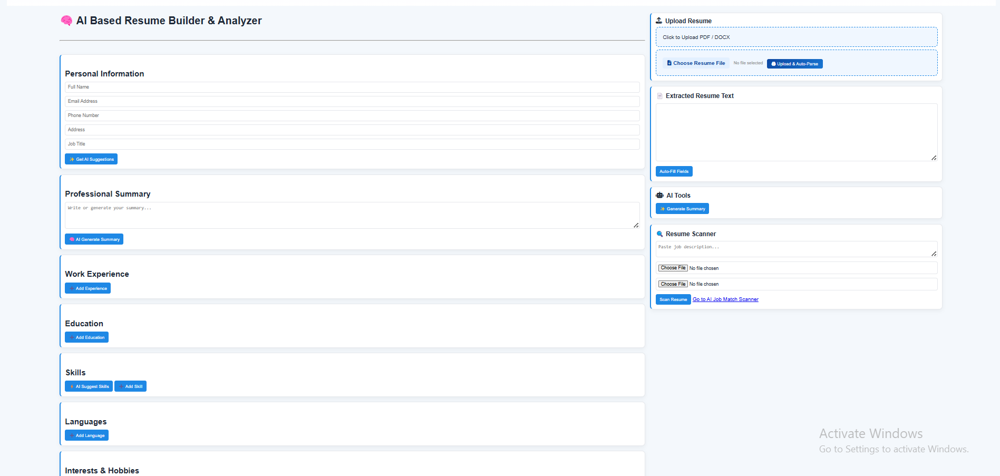
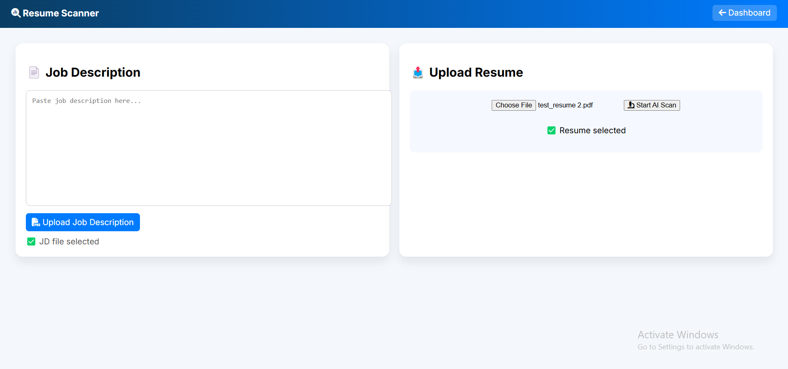

# AI Resume Builder & Scanner System

## 📌 Overview
The AI Resume Builder & Scanner System is a web-based application that helps users create professional, ATS-compliant resumes and analyze their compatibility with job descriptions using AI techniques.

---

## 🚀 Features

### 📝 Resume Builder
- Create structured and professional resumes
- Multiple sections (Education, Skills, Experience, etc.)
- ATS-friendly formatting

### 🤖 AI-Powered Suggestions
- Generates summaries, skills, and content
- Helps improve resume quality

### 📄 Resume Scanner
- Upload resume files
- Compare against job descriptions
- Match scoring and recommendations

---

## 🛠️ Technologies Used

- **Backend:** Python (Flask)
- **Database:** MySQL
- **Frontend:** HTML, CSS, JavaScript
- **AI/NLP:** NLTK
- **Tools:** WampServer / Localhost

---

## 📂 Project Structure

```bash 
AI-Resume-Builder-System/
│
├── app.py # Main Flask application
├── ai_engine.py # AI processing logic
├── ai_suggestions.py # AI suggestions module
├── auth/ # Authentication system
├── templates/ # HTML files
├── static/ # CSS, JS, assets
├── database.sql # Database schema
├── requirements.txt # Dependencies
└── README.md

---

## ⚙️ Installation Guide

### 1️⃣ Clone the repository
git clone https://github.com/tawazgman5-eng/AI-Resume-Builder-System.git

### 2️⃣ Navigate into the project
cd AI-Resume-Builder-System

### 3️⃣ Create virtual environment (optional but recommended)
python -m venv venv
venv\Scripts\activate

### 4️⃣ Install dependencies
pip install -r requirements.txt

### 5️⃣ Setup Database
- Open phpMyAdmin
- Create a database
- Import `database.sql`

### 6️⃣ Run the application

python app.py

### 7️⃣ Open in browser

http://127.0.0.1:5000


---

## 📸 Screenshots

### 🔹 Resume Builder Interface


### 🔹 Resume Analysis


---

## 🎯 Future Improvements
- Deploy system online (Render / Heroku)
- Improve AI accuracy
- Add multiple resume templates
- Enhance UI/UX design

---

## 👨‍💻 Author
**Tawanda Satiyi**

---

## 📬 Contact
- Email: your_email@example.com
- GitHub: https://github.com/tawazgman5-eng

